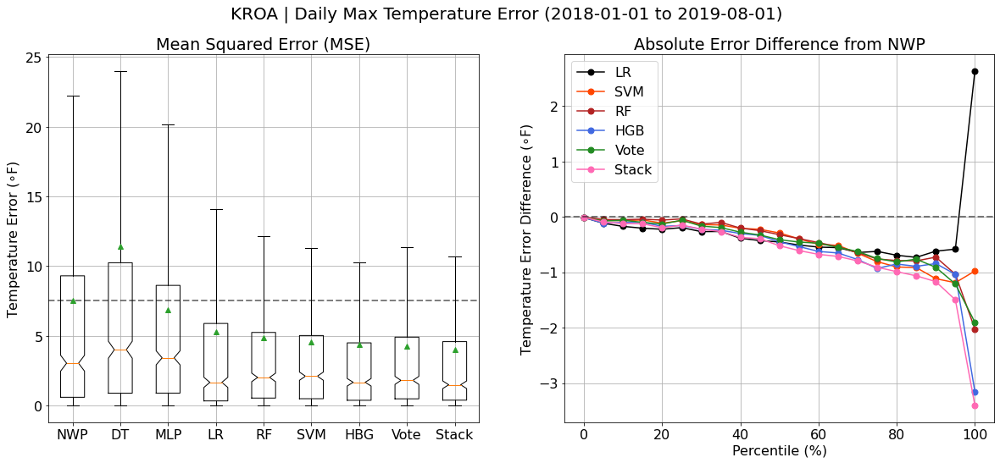
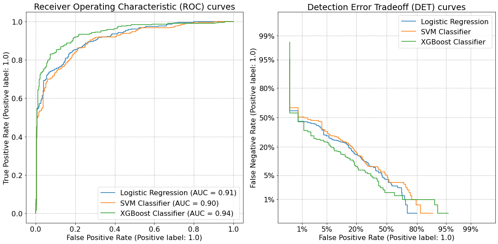

# ams-2021-ml-python-course-supervised-learning

## Supervised learning 

This module uses basic ML models – linear regression (LR), logistic regression, suport-vector machines (SVM), decision trees (DT), random forests (RF), and gradient-boosted trees (GB) to predict surface conditions at select Weather Challenge METAR sites.

Please cite the notebook as follows:
McNicholas, C., 2021: "Appying Supervised Machine Learning to Surface Weather Observations"

The data used in this tutorial and included in this repository can be cited as:
McGovern, A., Burke, A., Harrison, D., and G. M. Lackmann, 2020: A Machine Learning Tutorial for Operational Forecasting: Part I. Wea. Forecasting, In Press 

Additionally, the first half of the supervised learning notebook (1-5) was insipired by the lecture material cited below:
Burke, A., 2020: "Traditional Machine Learning Pipeline Applied to NWP Model Data"

### Course Outline

#### Brief
  1. What is ML/Artificial Intelligence (AI)
  2. General ML pipeline
  3. Prediction Problem and Dataset Information
  4. Data Visualization (or Visualisation if you're from the U.K.)

#### In-depth 
  5. Data Pre-processing
    - Partiation Data
    - Transforming and Scaling Data
  6. Machine Learning Models
    - Scoring
    - Linear Methods
    - Tree-based Methods
    - Ensemble and Aggregate Methods
  7. Model Evaluation
    - Feature Analysis
    - Accuracy and Reliability 
  8. Multi-output Regression
  9. Classification
    - Scoring
    - Feature Selection
    - Model Training
    - Performance
  10. Exercise
    - Feature Importance
    - Learning Curves
    - Practice

### Regression

Caption: A variety of supervised machine learning techniques are applied to predict maximum temperature at KROA (Roanoke-Blacksburg Airport, VA) between 2018-2019.
Each model was trained using NWP model forecast data retrieved between 2011 and 2017. The comparison in mean squared error and the percentile absolute error difference highlights the power of machine learning to constrain variance. For more details see notebook!

### Classification

Caption: Binary classification performance for precipitation prediction at KROA over the testing period (2018-2019). Receiver Operating Characteristic (ROC) curves are displayed on the left while Detection Error Tradeoff (DET) curves are shown on the right. Both plots show that machine learning models, in particular gradient boosting, outperform NWP in terms of precipitation prediction (i.e. precipitation = 1, no precipitatio = 0) on any given day. For more details see notebook! 

### Module Setup

If using google colab, simply load the .ipynb notebook into colab and begin. 

Alternatively, if you'd like to run these notebooks in jupyter, you'll need to ensure all necessary packages are installed.
This can be easily accomplished by setting up a new conda enivonrment with all the relevant packages.

Such an environment can be created from the yml file included in this repository. To create a new environment run the following command(s) from the terminal.

1) Create the environment
   - *conda env create -f ml_tutorial.yml*

2) Activate the environment
   - *conda activate ml_tutorial*
  
### [Notebooks](https://nbviewer.jupyter.org/github/cmac994/ams-2021-ml-python-course-supervised-learning/tree/master/notebooks/)

- [*Supervised_Learning_Notebook*](https://nbviewer.jupyter.org/github/cmac994/ams-2021-ml-python-course-supervised-learning/blob/master/notebooks/Supervised_Learning_Notebook.ipynb)
  - Overview and implementation of supervised machine learning for surface weather prediction.
- [*Supervised_Learning_Notebook_Key.ipynb*](https://nbviewer.jupyter.org/github/cmac994/ams-2021-ml-python-course-supervised-learning/blob/master/notebooks/Supervised_Learning_Notebook_Key.ipynb)
  - Same as above, but included excerise solutions within the final two cells.

### References and Acknowledgements

Burke, A., 2020: "Traditional Machine Learning Pipeline Applied to NWP Model Data"
The first half of the supervised learning notebook was largely insipired by the lecture material cited above.

McGovern, A., Burke, A., Harrison, D., and G. M. Lackmann, 2020: A Machine Learning Tutorial for Operational Forecasting: Part I. Wea. Forecasting, In Press 

